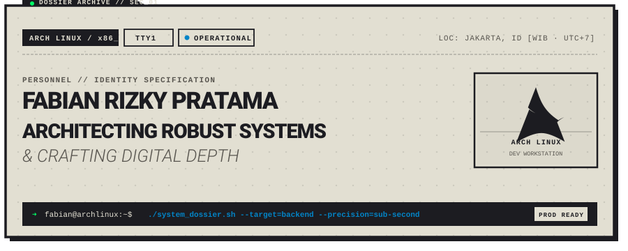
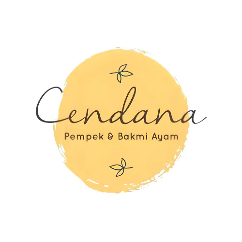
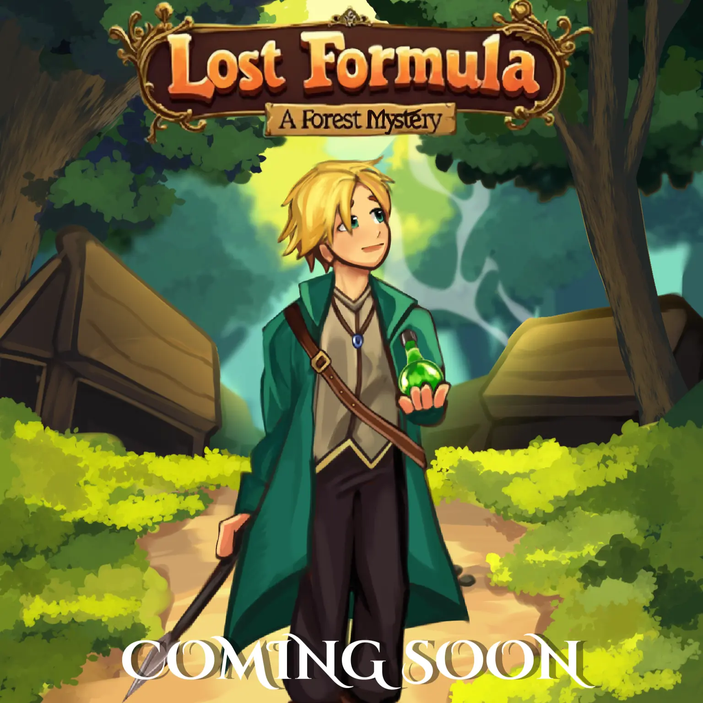
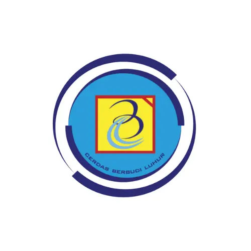
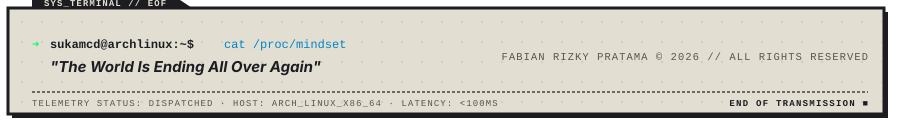

<!-- =============================================================== -->
<!-- FABIAN RIZKY PRATAMA // PERSONNEL DOSSIER & SYSTEM ARCHITECTURE -->
<!-- DESIGNED WITH THE PORTOFOLIO V2 BRUTALIST ARCH AESTHETIC       -->
<!-- =============================================================== -->

  <!-- Header Banner -->
  

  <!-- Animated Typing Subtitle -->
  

    
  

  <!-- Quick Telemetry Chips -->
  

    
    
    
    
    
  

---

### `// SEC_01 : PERSONNEL DOSSIER // ABOUT ME`

<table>
  <tr>
    <td width="28%" align="center" valign="middle" style="background-color: #1c1c21; border: 2.5px solid #1c1c21;">
      
       
      

        <code><b>FABIAN RIZKY PRATAMA</b></code> 
        <code>ARCH WORKSTATION // TTY1</code>
      

    </td>
    <td width="72%" valign="top">
      <h4><code>IDENTIFICATION &amp; OPERATIONAL SUMMARY</code></h4>
      

        Software Engineering student at <b>SMK Budi Luhur</b> with a dedicated focus on <b>Laravel 11 &amp; PostgreSQL</b> backend architecture, high-performance RESTful API engineering, and deterministic data workflows.
      

      

        Currently engineering and maintaining production web and mobile software as a <b>Mobile &amp; Web Developer at Istana Komputer · PT ISKOM SARANA NUSANTARA</b>. Prioritizing strict relational integrity, memory safety, and sub-second query latency on an <b>Arch Linux</b> environment.
      

      

      <table>
        <tr>
          <td><b>Host OS</b></td>
          <td><code>Arch Linux x86_64 // Neovim</code></td>
          <td><b>Primary Stack</b></td>
          <td><code>Laravel 11 · PostgreSQL · PHP 8+</code></td>
        </tr>
        <tr>
          <td><b>Station</b></td>
          <td><code>Jakarta, ID (WIB / UTC+7)</code></td>
          <td><b>Philosophy</b></td>
          <td><i>"Deterministic execution over guesswork."</i></td>
        </tr>
      </table>
    </td>
  </tr>
</table>

---

### `// SEC_02 : TECH ARSENAL &amp; SYSTEM CAPABILITIES`

#### `01 // BACKEND &amp; SYSTEMS ARCHITECTURE`
> *Engineering robust data architectures, structured APIs, and high-performance server logic.*

#### `02 // FRONTEND &amp; USER INTERFACES`
> *Designing interactive interfaces, cinematic motion transitions, and responsive client architectures.*

#### `03 // NATIVE, GAME ENGINE &amp; DEVOPS WORKFLOW`
> *Developing cross-platform engines, native apps, and automated developer tooling.*

---

### `// SEC_03 : ENGINEERING CASE FILES // FEATURED WORKS`

<table>
  <!-- Row 1: Kedai Cendana & Lost Formula -->
  <tr>
    <td width="50%" valign="top">
      

        
      

      <h3><code>01 // KEDAI CENDANA</code></h3>
      
<b>Category:</b> <code>Fullstack Web Application</code>

      
Unified institutional scholarship &amp; culinary management platform integrating modern Laravel architecture with Filament Admin Panel, indexed PostgreSQL database, and Google OAuth.

      

        <code>Laravel 11</code> · <code>PostgreSQL</code> · <code>Filament PHP</code> · <code>Google Auth</code>
      

      

        <b>Telemetry:</b> <code>Clean MVC</code> | <code>PostgreSQL Relational</code> | <code>OAuth 2.0 &amp; RBAC</code>
      

      

        🔗 <a href="https://kedaicendana.my.id"><b>Live Deployment</b></a> | 💻 <a href="https://github.com/SukaMCD/Beasiswa"><b>Source Code</b></a>
      

    </td>
    <td width="50%" valign="top">
      

        
      

      <h3><code>02 // LOST FORMULA: A FOREST MYSTERY</code></h3>
      
<b>Category:</b> <code>Game Dev &amp; Engine Architecture</code>

      
Atmospheric indie 2D top-down mystery adventure game engineered from scratch with Godot Engine 4. Implements isolated finite state machines, dynamic 2D lighting shaders, and inventory systems.

      

        <code>Godot Engine 4</code> · <code>GDScript</code> · <code>2D Lighting Shaders</code> · <code>State Machine</code>
      

      

        <b>Telemetry:</b> <code>Godot 4.x</code> | <code>60 FPS Locked</code> | <code>Top-Down Mystery</code>
      

      

        🎮 <a href="https://sukamcd.itch.io/lost-formula-a-forest-mystery"><b>Play on Itch.io</b></a> | 💻 <a href="https://github.com/SukaMCD/lost-formula"><b>Repository</b></a>
      

    </td>
  </tr>

  <!-- Row 2: Aplikasi Guru & Instagram Clone -->
  <tr>
    <td width="50%" valign="top">
      

        
      

      <h3><code>03 // FACULTY ACTIVITY MANAGEMENT SYSTEM</code></h3>
      
<b>Category:</b> <code>Enterprise Web App</code>

      
Institutional productivity platform built to streamline daily educator reporting and activity monitoring. Designed with strict relational PostgreSQL schemas ensuring high data integrity.

      

        <code>PHP 8</code> · <code>PostgreSQL</code> · <code>RESTful Design</code> · <code>Admin Dashboard</code>
      

      

        <b>Telemetry:</b> <code>+70% Paperless</code> | <code>&lt;120ms Indexing</code> | <code>Role-Based Access</code>
      

      

        💻 <a href="https://github.com/SukaMCD/Aplikasi-Guru"><b>GitHub Code</b></a>
      

    </td>
    <td width="50%" valign="top">
      

        
      

      <h3><code>04 // NATIVE ANDROID SOCIAL SUITE</code></h3>
      
<b>Category:</b> <code>Mobile Application</code>

      
Modern Android architectural implementation using Kotlin. Features optimized recycler view performance, asynchronous image pipelines, strict memory management, and Material 3 design.

      

        <code>Kotlin</code> · <code>Android SDK</code> · <code>Material Design 3</code> · <code>Coroutines</code> · <code>MVVM</code>
      

      

        <b>Telemetry:</b> <code>Native Android</code> | <code>MVVM Architecture</code> | <code>Asynchronous Pipeline</code>
      

      

        💻 <a href="https://github.com/ieatcheese99/Instagram.git"><b>Source Repository</b></a>
      

    </td>
  </tr>

  <!-- Row 3: Leafly Tea & Budi Luhur Portal -->
  <tr>
    <td width="50%" valign="top">
      

        
      

      <h3><code>05 // LEAFLY TEA DIGITAL COMMERCE</code></h3>
      
<b>Category:</b> <code>E-Commerce Experience</code>

      
Boutique artisanal beverage commerce storefront featuring dynamic catalog filtering, responsive search, cart state management, and frictionless checkout flows.

      

        <code>PHP</code> · <code>MySQL</code> · <code>JavaScript ES6</code> · <code>Responsive UI</code>
      

      

        <b>Telemetry:</b> <code>Sub-second Load</code> | <code>Dynamic Filtering</code> | <code>Mobile Optimized</code>
      

      

        🍵 <a href="https://budiluhurdigital.com/project/10RPL/LeaflyTea/"><b>Live Store Demo</b></a> | 💻 <a href="https://github.com/SukaMCD/LeaflyTea"><b>Code Repository</b></a>
      

    </td>
    <td width="50%" valign="top">
      

        
      

      <h3><code>06 // BUDI LUHUR INSTITUTIONAL WEB PORTAL</code></h3>
      
<b>Category:</b> <code>Institutional Platform</code>

      
Public institutional web architecture for SD Ceria Timoho and SMP Budi Luhur featuring comprehensive SEO optimization, modern security hardening, and intuitive layouts.

      

        <code>WordPress Headless/CMS</code> · <code>PHP</code> · <code>SEO Mastery</code> · <code>Security Hardening</code>
      

      

        <b>Telemetry:</b> <code>10k+ Monthly Visits</code> | <code>99.9% Uptime</code> | <code>95+ SEO Score</code>
      

      

        🏫 <a href="https://timoho.ceria.sch.id"><b>SD Ceria Portal</b></a> | 🏫 <a href="https://smp.sekolahbudiluhur.sch.id"><b>SMP Budi Luhur Portal</b></a>
      

    </td>
  </tr>
</table>

---

### `// SEC_04 : SERVICE RECORD &amp; CAREER TIMELINE`

| Period | Operational Designation | Organization / Venue | Core Focus &amp; Technologies |
| :--- | :--- | :--- | :--- |
| **`FEB 2026 — PRESENT`** | **Mobile &amp; Web Developer** *(Part-Time)* | **Istana Komputer · PT ISKOM SARANA NUSANTARA** | Engineered production web &amp; mobile solutions with Flutter, clean RESTful APIs, and strict application stability. |
| **`JAN 2025 — JUL 2025`** | **Frontend Developer (Web Team)** *(Hybrid)* | **SMK Budi Luhur** | Architected and optimized institutional web portals (SD Ceria &amp; SMP Budi Luhur) with responsive UI/UX and SEO tuning. |
| **`APR 2025 — MAY 2025`** | **Fullstack Developer** *(Freelance)* | **Leafly Tea E-Commerce** | Engineered scalable PHP backend architecture and dynamic JavaScript client flows for artisanal commerce. |
| **`MAR 2025 — MAY 2025`** | **Game Developer** *(Freelance)* | **Lost Formula: A Forest Mystery** | Developed core gameplay systems, state machines, and inventory pipelines on Godot Engine 4 (published on Itch.io). |

---

### `// SEC_05 : REPOSITORY TELEMETRY &amp; GITHUB STATS`

  <!-- Activity Graph (Themed to PortofolioV2 Dark Brutalist Palette) -->
  

    

  <!-- Stats Grid -->
  <table width="100%">
    <tr>
      <td width="50%" align="center" style="background-color: #1C1C21; border: 2px solid #1C1C21;">
        
      </td>
      <td width="50%" align="center" style="background-color: #1C1C21; border: 2px solid #1C1C21;">
        
      </td>
    </tr>
  </table>

   

  <!-- Streak Stats Card -->
  

---

### `// SEC_06 : TRANSMISSION GATEWAY // CONNECT &amp; SUPPORT`

  <b>Direct Inquiries, Collaborations, or System Architectural Discussions:</b>

 

---

### `// SEC_07 : CONTRIBUTION SNAKE GRID`

  <picture>
    <source media="(prefers-color-scheme: dark)" srcset="https://raw.githubusercontent.com/SukaMCD/SukaMCD/output/github-contribution-grid-snake-dark.svg"/>
    <source media="(prefers-color-scheme: light)" srcset="https://raw.githubusercontent.com/SukaMCD/SukaMCD/output/github-contribution-grid-snake.svg"/>
    
  </picture>

 

<!-- Brutalist Terminal Footer -->

  

