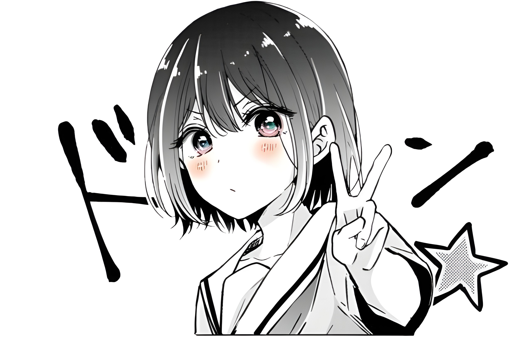

  <!-- Header Avatar from PortofolioV2 -->
  

  <h1>Fabian Rizky Pratama</h1>

  <!-- Typing Subtitle -->
  

    
  

  <!-- Status Badges -->
  

    
    
    
    
  

---

### ⚡ About Me

- 💻 **Focus:** Backend Architecture, High-Performance RESTful APIs & Data Systems.
- 🛠️ **Core Arsenal:** Laravel 11, PHP 8+, PostgreSQL, MySQL, Go, Bun.
- 🎓 **Education & Work:** Software Engineering student at **SMK Budi Luhur** & Developer at **Istana Komputer · PT ISKOM SARANA NUSANTARA**.
- 🐧 **Environment:** Arch Linux x86_64 // Neovim.
- 📍 **Location:** Jakarta, Indonesia.

---

### 🛠️ Tech Arsenal

  

---

### 📊 Telemetry & Activity

  

    

  

---

### 🌐 Connect & Dispatch

 

---

### 🐍 Contribution Graph

  <picture>
    <source media="(prefers-color-scheme: dark)" srcset="https://raw.githubusercontent.com/SukaMCD/SukaMCD/output/github-contribution-grid-snake-dark.svg"/>
    <source media="(prefers-color-scheme: light)" srcset="https://raw.githubusercontent.com/SukaMCD/SukaMCD/output/github-contribution-grid-snake.svg"/>
    
  </picture>

    

  <!-- Brutalist Terminal Footer -->
  

